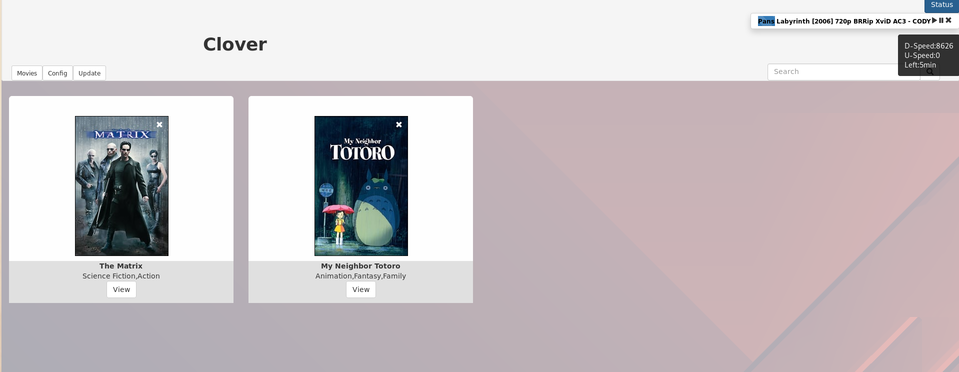

*******
Clover
*******

Clover is a local movie library and Piratebay download assistant. With the
help of `TMDB <https://themoviedb.org/>`_ you can download the genre and cover for your
favourite movies!

How-To
*******

There's a docker-compose setup inside this repo which handles all components
but some things still need to created manually at the beginning.

Before start:

* Create folder the folder /media/movies/complete or change it in docker-compose
* Uncomment - ``command: "npm install"``
* start docker-compose (``docker-compose up``)
* After successfully loading all npm packages kill it (ctrl+c)
* comment - ``command: "npm install"`` and uncomment - ``command: "npm start"``

After start:

* Create a API-Key `TMDB <https://themoviedb.org/>`_ and enter it under Config > API

Now you can head to http://localhost/

It's quite unconventional to filter the name to search it on tmdb.
There's a blacklisting approach in filenames which you'll find under Config.

The filename needs to be in the following format:

*MovieName [date].(mkv|mp4)*

Buggy as hell mate
*******

Currently it's extremely buggy and will most likely fail if you try to use it.

Known to fail
*******

* Deleting a movie :(
* Other things? (most likely)

Quality of code
*******
That's an old project and I have no intention to rewrite it.
I now handle errors in my code, I promise ;D

